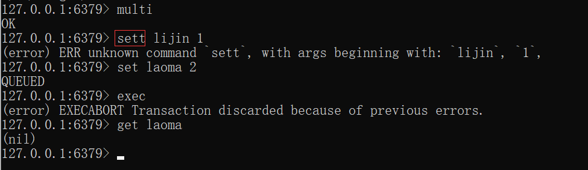
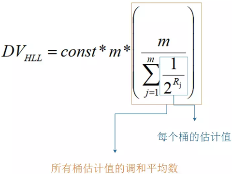
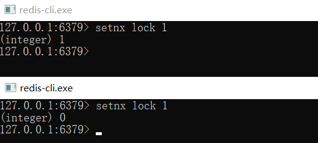
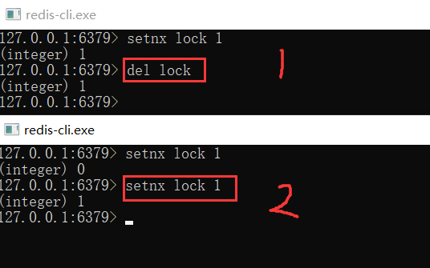
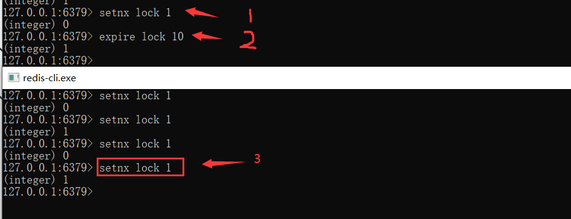

# Redis基础面试题

## 1. 为什么要使用Redis缓存

使用Redis缓存的目的就是提升读写性能。而实际业务场景下，更多的是为了提升读性能，带来更好的性能，带来更高的并发量。Redis的读写性能比 MySQL 好的多，我们就可以把 MySQL 中的热点数据缓存到 Redis中，提升读写性能，同时也减轻了 MySQL 的读取压力。

> Redis 单机并发10W  VS  MySQL 读1500  写 600 ~ 800

**缓存的好处**

- 读取速度快，因为数据存在内存种，所以数据获取快，单机轻松10W+并发

- 支持多种数据类型，包括字符串(String)，列表(List)，集合(Set)，有序集合(ZSet)， 哈希等

- 还拥有其他丰富的功能，主从复制、集群、数据持久化等

- 可以实现其他丰富的功能，消息队列、分布式锁等

## 2、为什么Redis单线程模型效率也能那么高？

- C 语言编写，效率高，离底层 很近
- 单线程的优势，可维护性高。多线程模型虽然在某些方面表现优异，但是它引入了程序执行顺序的不确定性，带来了并发读写的一系列问题，增加了系统复杂度、同时可能存在线程切换、甚至加锁解锁、死锁造成的性能损耗
- Pipeline：Redis主要受限与内存和网络，几乎不会占用太多的CPU。可以将命令和 pipeline结合起来使用，减少命令在网络上传输的时间，将多次网络IO 缩减 为 一次网络IO，通过使用pipeline每秒可以处理100万个请求
- 存储实现优化：Redis的基础数据结构每一种至少有2种及2种以上的实现，在不同的大小活长度下选用适合的数据类型，达到机制的存储效率，从而提高写入和读取的速度。

## 3、Redis6.0为什么要引入多线程呢？

**Redis多线程比单线程性能提升一倍：**

Redis 作者 antirez 在 RedisConf 2019 分享时层提到：Redis6 引入的多线程 IO 特性对性能提升至少是一倍以上。国内也有大牛曾 使用 unstable版本在 阿里云esc 进行测试， GET/SET 命令 在4线程 IO 时性能相比单线程几乎是翻倍了。

**巨头公司的需求**

Redis将所有数据放入到内存中，内存的响应时长大约是100纳秒，对于小数据包，Redis服务器可以处理80000 ~ 100000 QPS，这也是Redis处理的极限了，对于80%的公司来说，单线程的Redis已经足够使用了。

但随着越来越复杂的业务场景，有些公司动不动就是上亿的交易量，因此需要更大的QPS。

**集群方案的问题**

常见的解决方案是在分布式架构对数据进行分区并采用多个服务器，但该方案有非常大的缺点，例如要管理的Redis服务器太多，维护代价大；

某些适用于单个Redis服务器的命令不适用于数据分区；

数据分区无法解决热点读/写问题；数据偏斜，重新分配和放大/缩小变得更加复杂等等。

- 纯内存KV操作

Redis的操作都是基于内存的，CPU不是 Redis性能瓶颈,，Redis的瓶颈是机器内存和网络带宽。

在计算机的世界中，CPU的速度是远大于内存的速度的，同时内存的速度也是远大于硬盘的速度。redis的操作都是基于内存的，绝大部分请求是纯粹的内存操作，非常迅速。

- 单线程操作

使用单线程可以省去多线程时CPU上下文会切换的时间，也不用去考虑各种锁的问题，不存在加锁释放锁操作，没有死锁问题导致的性能消耗。对于内存系统来说，多次读写都是在一个CPU上，没有上下文切换效率就是最高的！既然单线程容易实现，而且 CPU 不会成为瓶颈，那就顺理成章的采用单线程的方案了

Redis 单线程指的是网络请求模块使用了一个线程，即一个线程处理所有网络请求，其他模块该使用多线程，仍会使用了多个线程。

- I/O 多路复用

为什么 Redis 中要使用 I/O 多路复用这种技术呢？

首先，Redis 是跑在单线程中的，所有的操作都是按照顺序线性执行的，但是由于读写操作等待用户输入或输出都是阻塞的，所以 I/O 操作在一般情况下往往不能直接返回，这会导致某一文件的 I/O 阻塞导致整个进程无法对其它客户提供服务，而 I/O 多路复用就是为了解决这个问题而出现的

- Reactor 设计模式

Redis基于Reactor模式开发了自己的网络事件处理器，称之为文件事件处理器(File Event Hanlder)。

## 4、讲一讲Redis常见数据结构以及使用场景

### 字符串（String）

**适合场景**

- 缓存功能

  > Redis 作为缓存层，MySQL作为存储层，绝大部分请求的数据都是从Redis中获取。由于Redis具有支撑高并发的特性,所以缓存通常能起到加速读写和降低后端压力的作用。

- 计数

  > 使用Redis 作为计数的基础工具，它可以实现快速计数、查询缓存的功能,同时数据可以异步落地到其他数据源。

 - 共享Session

   > 一个分布式Web服务将用户的Session信息（例如用户登录信息)保存在各自服务器中，这样会造成一个问题，出于负载均衡的考虑，分布式服务会将用户的访问均衡到不同服务器上，用户刷新一次访问可能会发现需要重新登录，这个问题是用户无法容忍的。
   >
   > 为了解决这个问题,可以使用Redis将用户的Session进行集中管理,，在这种模式下只要保证Redis是高可用和扩展性的,每次用户更新或者查询登录信息都直接从Redis中集中获取。

 - 限速

   > 比如，很多应用出于安全的考虑,会在每次进行登录时,让用户输入手机验证码,从而确定是否是用户本人。但是为了短信接口不被频繁访问,会限制用户每分钟获取验证码的频率，例如一分钟不能超过5次。一些网站限制一个IP地址不能在一秒钟之内方问超过n次也可以采用类似的思路。

### 哈希(Hash)

Java里提供了HashMap，Redis中也有类似的数据结构，就是哈希类型。但是要注意，哈希类型中的映射关系叫作field-value，注意这里的value是指field对应的值，不是键对应的值。

**适合场景**

哈希类型比较适宜存放对象类型的数据，我们可以比较下，如果数据库中表记录user为：

| id   | name  | age  |
| ---- | ----- | ---- |
| 1    | lijin | 18   |
| 2    | msb   | 20   |

**1、使用String类型**

需要一条条去插入获取。

set user:1:name lijin;

set user:1:age  18;

set user:2:name msb;

set user:2:age  20;

**优点：简单直观，每个键对应一个值**

**缺点：键数过多，占用内存多，用户信息过于分散，不用于生产环境**

**2、使用hash类型**

hmset user:1 name lijin age 18

hmset user:2 name msb age 20

优点：简单直观，使用合理可减少内存空间消耗

### 列表（list）

列表( list)类型是用来存储多个有序的字符串，a、b、c、c、b四个元素从左到右组成了一个有序的列表,列表中的每个字符串称为元素(element)，一个列表最多可以存储(2^32-1)个元素(*4294967295*)。


**适合场景**

每个用户有属于自己的文章列表，现需要分页展示文章列表。此时可以考虑使用列表,因为列表不但是有序的,同时支持按照索引范围获取元素。

消息队列，Redis 的 lpush+brpop命令组合即可实现阻塞队列，生产者客户端使用lrpush从列表左侧插入元素，多个消费者客户端使用brpop命令阻塞式的“抢”列表尾部的元素,多个客户端保证了消费的负载均衡和高可用性。

### 集合（set）


集合( set）类型也是用来保存多个的字符串元素,但和列表类型不一样的是，集合中不允许有重复元素,并且集合中的元素是无序的,不能通过索引下标获取元素。

**适合场景**

集合类型比较典型的使用场景是标签(tag)。例如一个用户可能对娱乐、体育比较感兴趣，另一个用户可能对历史、新闻比较感兴趣，这些兴趣点就是标签。有了这些数据就可以得到喜欢同一个标签的人，以及用户的共同喜好的标签，这些数据对于用户体验以及增强用户黏度比较重要。

例如一个电子商务的网站会对不同标签的用户做不同类型的推荐，比如对数码产品比较感兴趣的人，在各个页面或者通过邮件的形式给他们推荐最新的数码产品，通常会为网站带来更多的利益。

除此之外，集合还可以通过生成随机数进行比如抽奖活动，以及社交图谱等等。

### 有序集合（ZSET）


有序集合相对于哈希、列表、集合来说会有一点点陌生,但既然叫有序集合,那么它和集合必然有着联系,它保留了集合不能有重复成员的特性,但不同的是,有序集合中的元素可以排序。但是它和列表使用索引下标作为排序依据不同的是,它给每个元素设置一个分数( score)作为排序的依据。

有序集合中的元素不能重复，但是score可以重复，就和一个班里的同学学号不能重复,但是考试成绩可以相同。

有序集合提供了获取指定分数和元素范围查询、计算成员排名等功能，合理的利用有序集合，能帮助我们在实际开发中解决很多问题。

有序集合比较典型的使用场景就是排行榜系统。例如视频网站需要对用户上传的视频做排行榜，榜单的维度可能是多个方面的：按照时间、按照播放数量、按照获得的赞数。

## 5、pipeline有什么好处，为什么要用 pipeline？

Redis客户端执行一条命令分为如下4个部分:1）发送命令2）命令排队3）命令执行4）返回结果。


其中1和4花费的时间称为Round Trip Time (RTT,往返时间)，也就是数据在网络上传输的时间。

Redis提供了批量操作命令(例如mget、mset等)，有效地节约RTT。

但大部分命令是不支持批量操作的，例如要执行n次 hgetall命令，并没有mhgetall命令存在，需要消耗n次RTT。

举例：Redis的客户端和服务端可能部署在不同的机器上。例如客户端在本地，Redis服务器在阿里云的广州，两地直线距离约为800公里，那么1次RTT时间=800 x2/ ( 300000×2/3 ) =8毫秒，(光在真空中传输速度为每秒30万公里,这里假设光纤为光速的2/3 )。而Redis命令真正执行的时间通常在微秒(1000微妙=1毫秒)级别，所以才会有Redis 性能瓶颈是网络这样的说法。

Pipeline（流水线)机制能改善上面这类问题,它能将一组 Redis命令进行组装,通过一次RTT传输给Redis,再将这组Redis命令的执行结果按顺序返回给客户端,没有使用Pipeline执行了n条命令,整个过程需要n次RTT。


使用Pipeline 执行了n次命令，整个过程需要1次RTT。


Pipeline并不是什么新的技术或机制，很多技术上都使用过。而且RTT在不同网络环境下会有不同，例如同机房和同机器会比较快，跨机房跨地区会比较慢。

redis-cli的--pipe选项实际上就是使用Pipeline机制，但绝对部分情况下，我们使用Java语言的Redis客户端中的Pipeline会更多一点。

代码参见：

```java
com.msb.redis.adv.RedisPipeline
```


总的来说，在不同网络环境下非Pipeline和Pipeline执行10000次set操作的效果，在执行时间上的比对如下：


差距有100多倍，可以得到如下两个结论:

1、Pipeline执行速度一般比逐条执行要快。

2、客户端和服务端的网络延时越大，Pipeline的效果越明显。

## 6、Redis官方为什么不提供 Windows版本？

一个字懒，多一事不如少一事，Redis是开源软件。

Redis的Windows版本是3.0，之前微软维护，后续是tporadowski维护

[https://github.com/tporadowski/redis](https://github.com/tporadowski/redis)

## 7、Redis 持久化方式有哪些？以及有什么区别？

Redis 提供两种持久化机制 RDB 和 AOF 机制:

### RDB

RDB持久化是把当前进程数据生成快照保存到硬盘的过程。所谓内存快照，就是指内存中的数据在某一个时刻的状态记录。这就类似于照片，当你给朋友拍照时，一张照片就能把朋友一瞬间的形象完全记下来。RDB 就是Redis DataBase 的缩写。

**优点：**

只有一个文件 dump.rdb ，方便持久化。
容灾性好，一个文件可以保存到安全的磁盘。
性能最大化，fork 子进程来完成写操作，让主进程继续处理命令，所以是 IO 最大化。

相对于数据集大时，比AOF的启动效率更高。

**缺点：**

数据安全性低。 RDB是间隔一段时间进行持久化，如果持久化之间Redis发生故障，会发生数据丢失。所以这种方式更适合数据要求不严谨的时候。

### AOF

AOF(append only file)持久化:以独立日志的方式记录每次**写命令**，重启时再重新执行AOF文件中的命令达到恢复数据的目的。AOF的主要作用是解决了数据持久化的实时性,目前已经是Redis持久化的主流方式。

**缺点：**
(1) AOF 文件比 RDB 文件大，且恢复速度慢。
(2) 数据集大的时候，比 RDB 启动效率低

## 8、什么是Redis事务？原理是什么？

Redis 中的事务是一组命令的集合，是 Redis 的最小执行单位。它可以保证一次执行多个命令，每
个事务是一个单独的隔离操作，事务中的所有命令都会序列化、按顺序地执行。服务端在执行事务
的过程中，不会被其他客户端发送来的命令请求打断。
它的原理是先将属于一个事务的命令发送给 Redis，然后依次执行这些命令。

Redis 事务的注意点有哪些？
需要注意的点有：

Redis 事务是不支持回滚的，不像 MySQL 的事务一样，要么都执行要么都不执行；

Redis 服务端在执行事务的过程中，不会被其他客户端发送来的命令请求打断。直到事务命令
全部执行完毕才会执行其他客户端的命令。

Redis 事务为什么不支持回滚？

Redis 的事务不支持回滚，但是执行的命令有语法错误，Redis 会执行失败，这些问题可以从程序层
面捕获并解决。但是如果出现其他问题，则依然会继续执行余下的命令。这样做的原因是因为回滚
需要增加很多工作，而不支持回滚则可以保持简单、快速的特性。

### 事务

大家应该对事务比较了解，简单地说，事务表示一组动作，要么全部执行，要么全部不执行。

例如在社交网站上用户A关注了用户B，那么需要在用户A的关注表中加入用户B，并且在用户B的粉丝表中添加用户A，这两个行为要么全部执行，要么全部不执行,否则会出现数据不一致的情况。

Redis提供了简单的事务功能，将一组需要一起执行的命令放到multi和exec两个命令之间。multi 命令代表事务开始，exec命令代表事务结束。另外discard命令是回滚。

一个客户端


另外一个客户端

在事务没有提交的时查询（查不到数据）


在事务提交后查询（可以查到数据）


可以看到sadd命令此时的返回结果是QUEUED，代表命令并没有真正执行，而是暂时保存在Redis中的一个缓存队列（所以discard也只是丢弃这个缓存队列中的未执行命令，并不会回滚已经操作过的数据，这一点要和关系型数据库的Rollback操作区分开）。

只有当exec执行后，用户A关注用户B的行为才算完成，如下所示exec返回的两个结果对应sadd命令。

**但是要注意Redis的事务功能很弱。在事务回滚机制上，Redis只能对基本的语法错误进行判断。**

如果事务中的命令出现错误,Redis 的处理机制也不尽相同。

1、语法命令错误



例如下面操作错将set写成了sett，属于语法错误，会造成整个事务无法执行，事务内的操作都没有执行:

2、运行时错误

例如：事务内第一个命令简单的设置一个string类型，第二个对这个key进行sadd命令，这种就是运行时命令错误，因为语法是正确的:


可以看到Redis并不支持回滚功能，第一个set命令已经执行成功,开发人员需要自己修复这类问题。

### **Redis的事务原理**

事务是Redis实现在服务器端的行为，用户执行MULTI命令时，服务器会将对应这个用户的客户端对象设置为一个特殊的状态，在这个状态下后续用户执行的查询命令不会被真的执行，而是被服务器缓存起来，直到用户执行EXEC命令为止，服务器会将这个用户对应的客户端对象中缓存的命令按照提交的顺序依次执行。

## 9、如何在100个亿URL中快速判断某URL是否存在？

### 传统数据结构的不足

当然有人会想，我直接将网页URL存入数据库进行查找不就好了，或者建立一个哈希表进行查找不就OK了。

当数据量小的时候，这么思考是对的，

确实可以将值映射到 HashMap 的 Key，然后可以在 O(1) 的时间复杂度内返回结果，效率奇高。但是 HashMap 的实现也有缺点，例如存储容量占比高，考虑到负载因子的存在，通常空间是不能被用满的，举个例子如果一个1000万HashMap，Key=String（长度不超过16字符，且重复性极小），Value=Integer，会占据多少空间呢？1.2个G。实际上，1000万个int型，只需要40M左右空间，占比3%，1000万个Integer，需要161M左右空间，占比13.3%。可见一旦你的值很多例如上亿的时候，那HashMap 占据的内存大小就变得很可观了。

但如果整个网页黑名单系统包含100亿个网页URL，在数据库查找是很费时的，并且如果每个URL空间为64B，那么需要内存为640GB，一般的服务器很难达到这个需求。

### 布隆过滤器

#### 布隆过滤器简介

**1970 年布隆提出了一种布隆过滤器的算法，用来判断一个元素是否在一个集合中。
这种算法由一个二进制数组和一个 Hash 算法组成。**

本质上布隆过滤器是一种数据结构，比较巧妙的概率型数据结构（probabilistic data structure），特点是高效地插入和查询，可以用来告诉你 “某样东西一定不存在或者可能存在”。

相比于传统的 List、Set、Map 等数据结构，它更高效、占用空间更少，但是缺点是其返回的结果是概率性的，而不是确切的。

实际上，布隆过滤器广泛应用于网页黑名单系统、垃圾邮件过滤系统、爬虫网址判重系统等，Google 著名的分布式数据库 Bigtable 使用了布隆过滤器来查找不存在的行或列，以减少磁盘查找的IO次数，Google Chrome浏览器使用了布隆过滤器加速安全浏览服务。


#### 布隆过滤器的误判问题

Ø通过hash计算在数组上不一定在集合

Ø本质是hash冲突

Ø通过hash计算不在数组的一定不在集合（误判）


**优化方案**

增大数组(预估适合值)

增加hash函数


## 10、统计高并发网站每个网页每天的 UV 数据，结合Redis你会如何实现？

### 选用方案：HyperLogLog

如果统计 PV 那非常好办，给每个网页一个独立的 Redis 计数器就可以了，这个计数器的 key 后缀加上当天的日期。这样来一个请求，incrby 一次，最终就可以统计出所有的 PV 数据。

但是 UV 不一样，它要去重，同一个用户一天之内的多次访问请求只能计数一次。这就要求每一个网页请求都需要带上用户的 ID，无论是登陆用户还是未登陆用户都需要一个唯一 ID 来标识。

一个简单的方案，那就是为每一个页面一个独立的 set 集合来存储所有当天访问过此页面的用户 ID。当一个请求过来时，我们使用 sadd 将用户 ID 塞进去就可以了。通过 scard 可以取出这个集合的大小，这个数字就是这个页面的 UV 数据。

但是，如果你的页面访问量非常大，比如一个爆款页面几千万的 UV，你需要一个很大的 set集合来统计，这就非常浪费空间。如果这样的页面很多，那所需要的存储空间是惊人的。为这样一个去重功能就耗费这样多的存储空间，值得么？其实需要的数据又不需要太精确，105w 和 106w 这两个数字对于老板们来说并没有多大区别，So，有没有更好的解决方案呢？

这就是HyperLogLog的用武之地，Redis 提供了 HyperLogLog 数据结构就是用来解决这种统计问题的。HyperLogLog 提供不精确的去重计数方案，虽然不精确但是也不是非常不精确，Redis官方给出标准误差是0.81%，这样的精确度已经可以满足上面的UV 统计需求了。

### HyperLogLog与集合方案对比

百万级用户访问网站


### HyperLogLog使用

#### 操作命令

HyperLogLog提供了3个命令: pfadd、pfcount、pfmerge。

##### pfadd

pfadd key element [element …]

pfadd用于向HyperLogLog 添加元素,如果添加成功返回1:

pfadd u-9-30 u1 u2 u3 u4 u5 u6 u7 u8


##### pfcount

pfcount key [key …]

pfcount用于计算一个或多个HyperLogLog的独立总数，例如u-9-30 的独立总数为8:


如果此时向插入一些用户，用户并且有重复


如果我们继续往里面插入数据，比如插入100万条用户记录。内存增加非常少，但是pfcount 的统计结果会出现误差。

##### pfmerge

pfmerge destkey sourcekey [sourcekey ... ]

pfmerge可以求出多个HyperLogLog的并集并赋值给destkey，请自行测试。

可以看到，HyperLogLog内存占用量小得惊人，但是用如此小空间来估算如此巨大的数据，必然不是100%的正确，其中一定存在误差率。前面说过，Redis官方给出的数字是0.81%的失误率。

### HyperLogLog原理概述

##### 基本原理

HyperLogLog基于概率论中伯努利试验并结合了极大似然估算方法，并做了分桶优化。

实际上目前还没有发现更好的在大数据场景中准确计算基数的高效算法，因此在不追求绝对准确的情况下，使用概率算法算是一个不错的解决方案。概率算法不直接存储数据集合本身，通过一定的概率统计方法预估值，这种方法可以大大节省内存，同时保证误差控制在一定范围内。目前用于基数计数的概率算法包括:

举个例子来理解HyperLogLog
算法，有一天李瑾老师和马老师玩打赌的游戏。

规则如下: 抛硬币的游戏，每次抛的硬币可能正面，可能反面，没回合一直抛，直到每当抛到正面回合结束。

然后我跟马老师说，抛到正面最长的回合用到了7次，你来猜一猜，我用到了多少个回合做到的？


进行了n次实验，比如上图：

第一次试验: 抛了3次才出现正面，此时 k=3，n=1

第二次试验: 抛了2次才出现正面，此时 k=2，n=2

第三次试验: 抛了4次才出现正面，此时 k=4，n=3

…………

第n 次试验：抛了7次才出现正面，此时我们估算，k=7

马老师说大概你抛了128个回合。这个是怎么算的。

k是每回合抛到1所用的次数，我们已知的是最大的k值，可以用kmax表示。由于每次抛硬币的结果只有0和1两种情况，因此，能够推测出kmax在任意回合出现的概率 ，并由kmax结合极大似然估算的方法推测出n的次数n =
2^(k_max) 。概率学把这种问题叫做伯努利实验。

但是问题是，这种本身就是概率的问题，我跟马老师说，我只用到12次，并且有视频为证。

所以这种预估方法存在较大误差，为了改善误差情况，HLL中引入分桶平均的概念。

同样举抛硬币的例子，如果只有一组抛硬币实验，显然根据公式推导得到的实验次数的估计误差较大；如果100个组同时进行抛硬币实验，受运气影响的概率就很低了，每组分别进行多次抛硬币实验，并上报各自实验过程中抛到正面的抛掷次数的最大值，就能根据100组的平均值预估整体的实验次数了。

分桶平均的基本原理是将统计数据划分为m个桶，每个桶分别统计各自的kmax,并能得到各自的基数预估值，最终对这些基数预估值求平均得到整体的基数估计值。LLC中使用几何平均数预估整体的基数值，但是当统计数据量较小时误差较大；HLL在LLC基础上做了改进，**采用调和平均数过滤掉不健康的统计值**。

什么叫调和平均数呢？举个例子

求平均工资：A的是1000/月，B的30000/月。采用平均数的方式就是：
(1000 + 30000) / 2 = 15500

采用调和平均数的方式就是：
2/(1/1000 + 1/30000) ≈ 1935.484

可见调和平均数比平均数的好处就是不容易受到大的数值的影响，比平均数的效果是要更好的。

##### 结合Redis的实现理解原理

现在我们和前面的业务场景进行挂钩：统计网页每天的 UV 数据。

从前面的知识我们知道，伯努利实验就是如果是出现1的时机越晚，就说明你要做更多的实验，这个就好比你要中500万的双色球，你大概要买2000万张不同的彩票（去重），而如果是换成 二进制来算，可能是 第几十次才出现1。而你买一个中奖只有500块的排列3（3个10进制数），而如果是换成 二进制来算，你只需要10次左右出现1。

**1.转为比特串**

这里很重要的一点：hash函数，可以把不同的数据转成尽量不重复的数据，这点就有点像去重。

如果是64位的二进制，是不是hash函数可以把 2的64次方个不同的数据转成不一样的二进制。这里就跟放入了2的64次方个元素一样。

那么基于上面的估算结论，我们可以通过多次抛硬币实验的最大抛到正面的次数来预估总共进行了多少次实验（多少个不同的数据），同样存储的时候也可以优化，每次add一个元素时，只要算法最后出现1的位数，把这个位数做一个最大的替换久可以。（如果添加的元素比 记录之前位数小则不记录，只要大才记录）

**2.分桶**

分桶就是分多少轮。抽象到计算机存储中去，就是存储的是一个以单位是比特(bit)，长度为 L 的大数组 S ，将 S 平均分为 m 组，注意这个 m 组，就是对应多少轮，然后每组所占有的比特个数是平均的，设为 P。容易得出下面的关系：

比如有4个桶的话，那么可以截取低2位作为分桶的依据。

比如

10010000   进入0号桶

10010001   进入1号桶

10010010   进入2号桶

10010011   进入3号桶

##### Redis 中的 HyperLogLog 实现

**pfadd**


当我们执行这个操作时，lijin这个字符串就会被转化成64个bit的二进制比特串。

这里很重要的一点：hash函数，可以把不同的数据转成尽量不重复的数据，这点就有点像去重。

如果是64位的二进制，是不是hash函数可以把 2的64次方个不同的数据转成不一样的二进制。这里就跟放入了2的64次方个元素一样。

那么基于上面的估算结论，我们可以通过多次抛硬币实验的最大抛到正面的次数来预估总共进行了多少次实验（多少个不同的数据），同样存储的时候也可以优化，每次add一个元素时，只要算法最后出现1的位数，把这个位数做一个最大的替换久可以。（如果添加的元素比 记录之前位数小则不记录，只要大才记录）

0010....0001  64位

然后在Redis中要分到16384个桶中（为什么是这么多桶：第一降低误判，第二，用到了14位二进制：2的14次方=16384）

怎么分？根据得到的比特串的后14位来做判断即可。


根据上述的规则，我们知道这个数据要分到 1号桶，同时从左往右（低位到高位）计算第1个出现的1的位置，这里是第4位，那么就往这个1号桶插入4的数据（转成二进制）

如果有第二个数据来了，按照上述的规则进行计算。

那么问题来了，如果分到桶的数据有重复了（这里比大小，大的替换小的）：

规则如下，比大小（比出现位置的大小），比如有个数据是最高位才出现1，那么这个位置算出来就是50，50比4大，则进行替换。1号桶的数据就变成了50（二进制是110010）

所以这里可以看到，每个桶的数据一般情况下6位存储即可。

所以我们这里可以推算一下一个key的HyperLogLog只占据多少的存储。

16384*6 /8/1024=12k。并且这里最多可以存储多少数据，因为是64位吗，所以就是2的64次方的数据，这个存储的数据非常非常大的，一般用户用long来定义，最大值也只有这么多。

**pfcount**

进行统计的时候，就是把16384桶，把每个桶的值拿出来，比如取出是 n,那么访问次数（里面）就是2的n次方。


然后把每个桶的值做调和平均数，就可以算出一个算法值。

同时，在具体的算法实现上，HLL还有一个分阶段偏差修正算法。我们就不做更深入的了解了。



const和m都是Redis里面根据数据做的调和平均数。

## 11、说一说Redis的Key和Value的数据结构组织?

### 全局哈希表

为了实现从键到值的快速访问，Redis 使用了一个哈希表来保存所有键值对。一个哈希表，其实就是一个数组，数组的每个元素称为一个哈希桶。所以，我们常说，一个哈希表是由多个哈希桶组成的，每个哈希桶中保存了键值对数据。


哈希桶中的 entry 元素中保存了*key和*value指针，分别指向了实际的键和值，这样一来，即使值是一个集合，也可以通过*value指针被查找到。因为这个哈希表保存了所有的键值对，所以，我也把它称为全局哈希表。

哈希表的最大好处很明显，就是让我们可以用 O(1) 的时间复杂度来快速查找到键值对：我们只需要计算键的哈希值，就可以知道它所对应的哈希桶位置，然后就可以访问相应的 entry 元素。

但当你往 Redis 中写入大量数据后，就可能发现操作有时候会突然变慢了。这其实是因为你忽略了一个潜在
的风险点，那就是哈希表的冲突问题和 rehash 可能带来的操作阻塞。

当你往哈希表中写入更多数据时，哈希冲突是不可避免的问题。这里的哈希冲突，两个 key 的哈希值和哈希桶计算对应关系时，正好落在了同一个哈希桶中。


Redis 解决哈希冲突的方式，就是链式哈希。链式哈希也很容易理解，就是指同一个哈希桶中的多个元素用一个链表来保存，它们之间依次用指针连接。

## 12、渐进式rehash听过没？讲一讲！

Redis是当然如果这个数组一直不变，那么hash冲突会变很多，这个时候检索效率会大打折扣，所以Redis就需要把数组进行扩容（一般是扩大到原来的两倍），但是问题来了，扩容后每个hash桶的数据会分散到不同的位置，这里设计到元素的移动，必定会阻塞IO，所以这个ReHash过程会导致很多请求阻塞。

### 渐进式rehash

为了避免这个问题，Redis 采用了渐进式 rehash。

首先、Redis 默认使用了两个全局哈希表：哈希表 1 和哈希表 2。一开始，当你刚插入数据时，默认使用哈希表 1，此时的哈希表 2 并没有被分配空间。随着数据逐步增多，Redis 开始执行 rehash。

1、给哈希表 2 分配更大的空间，例如是当前哈希表 1 大小的两倍

2、把哈希表 1 中的数据重新映射并拷贝到哈希表 2 中

3、释放哈希表 1 的空间

在上面的第二步涉及大量的数据拷贝，如果一次性把哈希表 1 中的数据都迁移完，会造成 Redis 线程阻塞，无法服务其他请求。此时，Redis 就无法快速访问数据了。


在Redis 开始执行 rehash，Redis仍然正常处理客户端请求，但是要加入一个额外的处理：

处理第1个请求时，把哈希表 1中的第1个索引位置上的所有 entries 拷贝到哈希表 2 中

处理第2个请求时，把哈希表 1中的第2个索引位置上的所有 entries 拷贝到哈希表 2 中

如此循环，直到把所有的索引位置的数据都拷贝到哈希表 2 中。

这样就巧妙地把一次性大量拷贝的开销，分摊到了多次处理请求的过程中，避免了耗时操作，保证了数据的快速访问。

所以这里基本上也可以确保根据key找value的操作在O（1）左右。

## 13、讲一讲Redis分布式锁的实现

### Redis分布式锁最简单的实现

想要实现分布式锁，必须要求 Redis 有「互斥」的能力，我们可以使用 SETNX 命令，这个命令表示SET if Not Exists，即如果 key 不存在，才会设置它的值，否则什么也不做。

两个客户端进程可以执行这个命令，达到互斥，就可以实现一个分布式锁。

客户端 1 申请加锁，加锁成功：

客户端 2 申请加锁，因为它后到达，加锁失败：



此时，加锁成功的客户端，就可以去操作「共享资源」，例如，修改 MySQL 的某一行数据，或者调用一个 API 请求。

操作完成后，还要及时释放锁，给后来者让出操作共享资源的机会。如何释放锁呢？

也很简单，直接使用 DEL 命令删除这个 key 即可，这个逻辑非常简单。



但是，它存在一个很大的问题，当客户端 1 拿到锁后，如果发生下面的场景，就会造成「死锁」：

1、程序处理业务逻辑异常，没及时释放锁

2、进程挂了，没机会释放锁

这时，这个客户端就会一直占用这个锁，而其它客户端就「永远」拿不到这把锁了。怎么解决这个问题呢？

### 如何避免死锁？

我们很容易想到的方案是，在申请锁时，给这把锁设置一个「租期」。

在 Redis 中实现时，就是给这个 key 设置一个「过期时间」。这里我们假设，操作共享资源的时间不会超过 10s，那么在加锁时，给这个 key 设置 10s 过期即可：

```
SETNX lock 1    // 加锁
EXPIRE lock 10  // 10s后自动过期
```



这样一来，无论客户端是否异常，这个锁都可以在 10s 后被「自动释放」，其它客户端依旧可以拿到锁。

但现在还是有问题：

现在的操作，加锁、设置过期是 2 条命令，有没有可能只执行了第一条，第二条却「来不及」执行的情况发生呢？例如：

* SETNX 执行成功，执行EXPIRE  时由于网络问题，执行失败
* SETNX 执行成功，Redis 异常宕机，EXPIRE 没有机会执行
* SETNX 执行成功，客户端异常崩溃，EXPIRE也没有机会执行

总之，这两条命令不能保证是原子操作（一起成功），就有潜在的风险导致过期时间设置失败，依旧发生「死锁」问题。

在 Redis 2.6.12 之后，Redis 扩展了 SET 命令的参数，用这一条命令就可以了：

```
SET lock 1 EX 10 NX
```


### 锁被别人释放怎么办？

上面的命令执行时，每个客户端在释放锁时，都是「无脑」操作，并没有检查这把锁是否还「归自己持有」，所以就会发生释放别人锁的风险，这样的解锁流程，很不「严谨」！如何解决这个问题呢？

解决办法是：客户端在加锁时，设置一个只有自己知道的「唯一标识」进去。

例如，可以是自己的线程 ID，也可以是一个 UUID（随机且唯一），这里我们以UUID 举例：

```
SET lock $uuid EX 20 NX
```

之后，在释放锁时，要先判断这把锁是否还归自己持有，伪代码可以这么写：

```
if redis.get("lock") == $uuid:
    redis.del("lock")
```

这里释放锁使用的是 GET + DEL 两条命令，这时，又会遇到我们前面讲的原子性问题了。这里可以使用lua脚本来解决。

安全释放锁的 Lua 脚本如下：

```
if redis.call("GET",KEYS[1]) == ARGV[1]
then
    return redis.call("DEL",KEYS[1])
else
    return 0
end
```

好了，这样一路优化，整个的加锁、解锁的流程就更「严谨」了。

这里我们先小结一下，基于 Redis 实现的分布式锁，一个严谨的的流程如下：

1、加锁

```
SET lock_key $unique_id EX $expire_time NX
```

2、操作共享资源

3、释放锁：Lua 脚本，先 GET 判断锁是否归属自己，再DEL 释放锁

### Java代码实现分布式锁

```
package com.msb.redis.lock;

import org.springframework.beans.factory.annotation.Autowired;
import org.springframework.stereotype.Component;
import redis.clients.jedis.Jedis;
import redis.clients.jedis.JedisPool;
import redis.clients.jedis.params.SetParams;

import java.util.Arrays;
import java.util.UUID;
import java.util.concurrent.TimeUnit;
import java.util.concurrent.locks.Condition;
import java.util.concurrent.locks.Lock;

/**
 * 分布式锁的实现
 */
@Component
public class RedisDistLock implements Lock {

    private final static int LOCK_TIME = 5*1000;
    private final static String RS_DISTLOCK_NS = "tdln:";
    /*
     if redis.call('get',KEYS[1])==ARGV[1] then
        return redis.call('del', KEYS[1])
    else return 0 end
     */
    private final static String RELEASE_LOCK_LUA =
            "if redis.call('get',KEYS[1])==ARGV[1] then\n" +
                    "        return redis.call('del', KEYS[1])\n" +
                    "    else return 0 end";
    /*保存每个线程的独有的ID值*/
    private ThreadLocal<String> lockerId = new ThreadLocal<>();

    /*解决锁的重入*/
    private Thread ownerThread;
    private String lockName = "lock";

    @Autowired
    private JedisPool jedisPool;

    public String getLockName() {
        return lockName;
    }

    public void setLockName(String lockName) {
        this.lockName = lockName;
    }

    public Thread getOwnerThread() {
        return ownerThread;
    }

    public void setOwnerThread(Thread ownerThread) {
        this.ownerThread = ownerThread;
    }

    @Override
    public void lock() {
        while(!tryLock()){
            try {
                Thread.sleep(100);
            } catch (InterruptedException e) {
                e.printStackTrace();
            }
        }
    }

    @Override
    public void lockInterruptibly() throws InterruptedException {
        throw new UnsupportedOperationException("不支持可中断获取锁！");
    }

    @Override
    public boolean tryLock() {
        Thread t = Thread.currentThread();
        if(ownerThread==t){/*说明本线程持有锁*/
            return true;
        }else if(ownerThread!=null){/*本进程里有其他线程持有分布式锁*/
            return false;
        }
        Jedis jedis = null;
        try {
            String id = UUID.randomUUID().toString();
            SetParams params = new SetParams();
            params.px(LOCK_TIME);
            params.nx();
            synchronized (this){/*线程们，本地抢锁*/
                if((ownerThread==null)&&
                "OK".equals(jedis.set(RS_DISTLOCK_NS+lockName,id,params))){
                    lockerId.set(id);
                    setOwnerThread(t);
                    return true;
                }else{
                    return false;
                }
            }
        } catch (Exception e) {
            throw new RuntimeException("分布式锁尝试加锁失败！");
        } finally {
            jedis.close();
        }
    }

    @Override
    public boolean tryLock(long time, TimeUnit unit) throws InterruptedException {
        throw new UnsupportedOperationException("不支持等待尝试获取锁！");
    }

    @Override
    public void unlock() {
        if(ownerThread!=Thread.currentThread()) {
            throw new RuntimeException("试图释放无所有权的锁！");
        }
        Jedis jedis = null;
        try {
            jedis = jedisPool.getResource();
            Long result = (Long)jedis.eval(RELEASE_LOCK_LUA,
                    Arrays.asList(RS_DISTLOCK_NS+lockName),
                    Arrays.asList(lockerId.get()));
            if(result.longValue()!=0L){
                System.out.println("Redis上的锁已释放！");
            }else{
                System.out.println("Redis上的锁释放失败！");
            }
        } catch (Exception e) {
            throw new RuntimeException("释放锁失败！",e);
        } finally {
            if(jedis!=null) jedis.close();
            lockerId.remove();
            setOwnerThread(null);
            System.out.println("本地锁所有权已释放！");
        }
    }

    @Override
    public Condition newCondition() {
        throw new UnsupportedOperationException("不支持等待通知操作！");
    }

}

```

### 锁过期时间不好评估怎么办？


看上面这张图，加入key的失效时间是10s，但是客户端C在拿到分布式锁之后，然后业务逻辑执行超过10s，那么问题来了，在客户端C释放锁之前，其实这把锁已经失效了，那么客户端A和客户端B都可以去拿锁，这样就已经失去了分布式锁的功能了！！！

比较简单的妥协方案是，尽量「冗余」过期时间，降低锁提前过期的概率，但是这个并不能完美解决问题，那怎么办呢？

#### 分布式锁加入看门狗

加锁时，先设置一个过期时间，然后我们开启一个「守护线程」，定时去检测这个锁的失效时间，如果锁快要过期了，操作共享资源还未完成，那么就自动对锁进行「续期」，重新设置过期时间。

这个守护线程我们一般也把它叫做「看门狗」线程。

为什么要使用守护线程：


#### 分布式锁加入看门狗代码实现


运行效果：


### Redisson中的分布式锁

Redisson把这些工作都封装好了

```
     <dependency>
            <groupId>org.redisson</groupId>
            <artifactId>redisson</artifactId>
            <version>3.12.3</version>
        </dependency>
```

```
package com.msb.redis.config;

import org.redisson.Redisson;
import org.redisson.api.RedissonClient;
import org.redisson.config.Config;
import org.springframework.context.annotation.Bean;
import org.springframework.context.annotation.Configuration;

@Configuration
public class MyRedissonConfig {
    /**
     * 所有对Redisson的使用都是通过RedissonClient
     */
    @Bean(destroyMethod="shutdown")
    public RedissonClient redisson(){
        //1、创建配置
        Config config = new Config();
        config.useSingleServer().setAddress("redis://127.0.0.1:6379");

        //2、根据Config创建出RedissonClient实例
        RedissonClient redisson = Redisson.create(config);
        return redisson;
    }
}

```

```
package com.msb.redis.redisbase.adv;


import com.msb.redis.lock.rdl.RedisDistLockWithDog;
import org.junit.jupiter.api.Test;
import org.redisson.Redisson;
import org.redisson.api.RLock;
import org.redisson.api.RedissonClient;
import org.redisson.config.Config;
import org.springframework.beans.factory.annotation.Autowired;
import org.springframework.boot.test.context.SpringBootTest;

import java.util.concurrent.CountDownLatch;
import java.util.concurrent.ExecutorService;
import java.util.concurrent.Executors;
import java.util.concurrent.TimeUnit;

@SpringBootTest
public class TestRedissionLock {

    private int count = 0;
    @Autowired
    private RedissonClient redisson;

    @Test
    public void testLockWithDog() throws InterruptedException {
        int clientCount =3;
        RLock lock = redisson.getLock("RD-lock");
        CountDownLatch countDownLatch = new CountDownLatch(clientCount);
        ExecutorService executorService = Executors.newFixedThreadPool(clientCount);
        for (int i = 0;i<clientCount;i++){
            executorService.execute(() -> {
                try {
                    lock.lock(10, TimeUnit.SECONDS);
                    System.out.println(Thread.currentThread().getName()+"准备进行累加。");
                    Thread.sleep(2000);
                    count++;
                } catch (InterruptedException e) {
                    e.printStackTrace();
                } finally {
                    lock.unlock();
                }
                countDownLatch.countDown();
            });
        }
        countDownLatch.await();
        System.out.println(count);
    }
}

```

https://github.com/redisson/redisson/

[https://redisson.org/](https://redisson.org/)

锁过期时间不好评估怎么办？

## 14、Redlock听过没？讲一讲！

Redis 作者提出的 Redlock方案，是如何解决主从切换后，锁失效问题的。

**Redlock 的方案基于一个前提：**

不再需要部署从库和哨兵实例，只部署主库；但主库要部署多个，官方推荐至少 5 个实例。

**注意：不是部署 Redis Cluster，就是部署 5 个简单的 Redis 实例。它们之间没有任何关系，都是一个个孤立的实例。**

做完之后，我们看官网代码怎么去用的：

[8. 分布式锁和同步器 · redisson/redisson Wiki · GitHub](https://github.com/redisson/redisson/wiki/8.-%E5%88%86%E5%B8%83%E5%BC%8F%E9%94%81%E5%92%8C%E5%90%8C%E6%AD%A5%E5%99%A8#84-%E7%BA%A2%E9%94%81redlock)

**8.4. 红锁（RedLock）**

基于Redis的Redisson红锁 `RedissonRedLock`对象实现了[Redlock](http://redis.cn/topics/distlock.html)介绍的加锁算法。该对象也可以用来将多个 `RLock`对象关联为一个红锁，每个 `RLock`对象实例可以来自于不同的Redisson实例。

```java
RLock lock1 = redissonInstance1.getLock("lock1");
RLock lock2 = redissonInstance2.getLock("lock2");
RLock lock3 = redissonInstance3.getLock("lock3");

RedissonRedLock lock = new RedissonRedLock(lock1, lock2, lock3);
// 同时加锁：lock1 lock2 lock3
// 红锁在大部分节点上加锁成功就算成功。
lock.lock();
...
lock.unlock();
```

大家都知道，如果负责储存某些分布式锁的某些Redis节点宕机以后，而且这些锁正好处于锁住的状态时，这些锁会出现锁死的状态。为了避免这种情况的发生，Redisson内部提供了一个监控锁的看门狗，它的作用是在Redisson实例被关闭前，不断的延长锁的有效期。默认情况下，看门狗的检查锁的超时时间是30秒钟，也可以通过修改[Config.lockWatchdogTimeout](https://github.com/redisson/redisson/wiki/2.-%E9%85%8D%E7%BD%AE%E6%96%B9%E6%B3%95#lockwatchdogtimeout%E7%9B%91%E6%8E%A7%E9%94%81%E7%9A%84%E7%9C%8B%E9%97%A8%E7%8B%97%E8%B6%85%E6%97%B6%E5%8D%95%E4%BD%8D%E6%AF%AB%E7%A7%92)来另行指定。

另外Redisson还通过加锁的方法提供了 `leaseTime`的参数来指定加锁的时间。超过这个时间后锁便自动解开了。

```java
RedissonRedLock lock = new RedissonRedLock(lock1, lock2, lock3);
// 给lock1，lock2，lock3加锁，如果没有手动解开的话，10秒钟后将会自动解开
lock.lock(10, TimeUnit.SECONDS);

// 为加锁等待100秒时间，并在加锁成功10秒钟后自动解开
boolean res = lock.tryLock(100, 10, TimeUnit.SECONDS);
...
lock.unlock();
```

### Redlock实现整体流程

1、客户端先获取「当前时间戳T1」

2、客户端依次向这 5 个 Redis 实例发起加锁请求

3、如果客户端从 >=3 个（大多数）以上Redis 实例加锁成功，则再次获取「当前时间戳T2」，如果 T2 - T1 &#x3c; 锁的过期时间，此时，认为客户端加锁成功，否则认为加锁失败。

4、加锁成功，去操作共享资源

5、加锁失败/释放锁，向「全部节点」发起释放锁请求。

所以总的来说：客户端在多个 Redis 实例上申请加锁；必须保证大多数节点加锁成功；大多数节点加锁的总耗时，要小于锁设置的过期时间；释放锁，要向全部节点发起释放锁请求。

**我们来看 Redlock 为什么要这么做？**

1) **为什么要在多个实例上加锁？**

本质上是为了「容错」，部分实例异常宕机，剩余的实例加锁成功，整个锁服务依旧可用。

2) **为什么大多数加锁成功，才算成功？**

多个 Redis 实例一起来用，其实就组成了一个「分布式系统」。在分布式系统中，总会出现「异常节点」，所以，在谈论分布式系统问题时，需要考虑异常节点达到多少个，也依旧不会影响整个系统的「正确性」。

这是一个分布式系统「容错」问题，这个问题的结论是：如果只存在「故障」节点，只要大多数节点正常，那么整个系统依旧是可以提供正确服务的。

3) **为什么步骤 3 加锁成功后，还要计算加锁的累计耗时？**

因为操作的是多个节点，所以耗时肯定会比操作单个实例耗时更久，而且，因为是网络请求，网络情况是复杂的，有可能存在延迟、丢包、超时等情况发生，网络请求越多，异常发生的概率就越大。

所以，即使大多数节点加锁成功，但如果加锁的累计耗时已经「超过」了锁的过期时间，那此时有些实例上的锁可能已经失效了，这个锁就没有意义了。

4) **为什么释放锁，要操作所有节点？**

在某一个 Redis 节点加锁时，可能因为「网络原因」导致加锁失败。

例如，客户端在一个 Redis 实例上加锁成功，但在读取响应结果时，网络问题导致读取失败，那这把锁其实已经在 Redis 上加锁成功了。

所以，释放锁时，不管之前有没有加锁成功，需要释放「所有节点」的锁，以保证清理节点上「残留」的锁。

好了，明白了 Redlock 的流程和相关问题，看似Redlock 确实解决了 Redis 节点异常宕机锁失效的问题，保证了锁的「安全性」。

但事实真的如此吗？

### RedLock的是是非非

一个分布式系统，更像一个复杂的「野兽」，存在着你想不到的各种异常情况。

这些异常场景主要包括三大块，这也是分布式系统会遇到的三座大山：NPC。

N：Network Delay，网络延迟

P：Process Pause，进程暂停（GC）

C：Clock Drift，时钟漂移

比如一个进程暂停（GC）的例子


1）客户端 1 请求锁定节点 A、B、C、D、E

2）客户端 1 的拿到锁后，进入 GC（时间比较久）

3）所有 Redis 节点上的锁都过期了

4）客户端 2 获取到了 A、B、C、D、E 上的锁

5）客户端 1 GC 结束，认为成功获取锁

6）客户端 2 也认为获取到了锁，发生「冲突」

GC 和网络延迟问题：这两点可以在红锁实现流程的第3步来解决这个问题。

但是最核心的还是时钟漂移，因为时钟漂移，就有可能导致第3步的判断本身就是一个BUG，所以当多个 Redis 节点「时钟」发生问题时，也会导致 Redlock 锁失效。

### RedLock总结

Redlock 只有建立在「时钟正确」的前提下，才能正常工作，如果你可以保证这个前提，那么可以拿来使用。

但是时钟偏移在现实中是存在的：

第一，从硬件角度来说，时钟发生偏移是时有发生，无法避免。例如，CPU 温度、机器负载、芯片材料都是有可能导致时钟发生偏移的。

第二，人为错误也是很难完全避免的。

所以，Redlock尽量不用它，而且它的性能不如单机版 Redis，部署成本也高，优先考虑使用主从+ 哨兵的模式
实现分布式锁（只会有很小的记录发生主从切换时的锁丢失问题）。