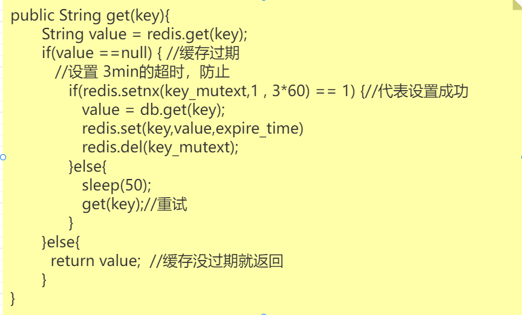
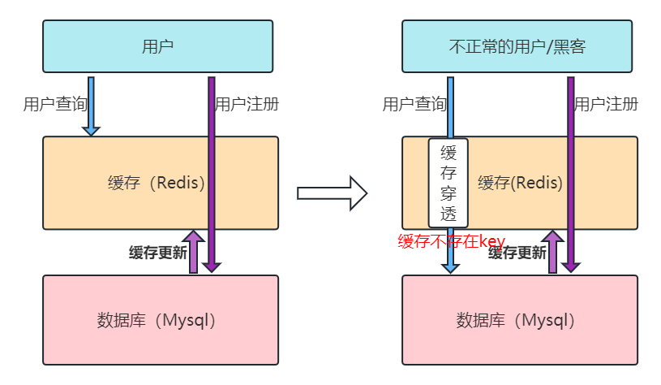
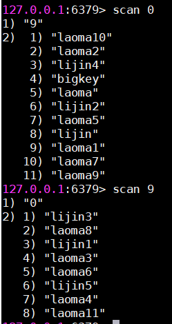
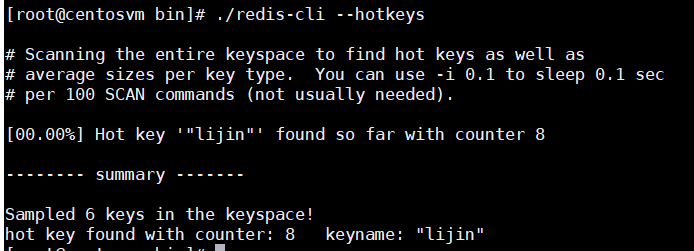
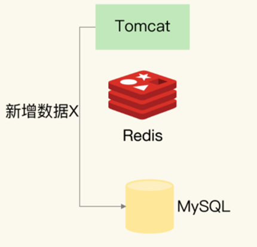
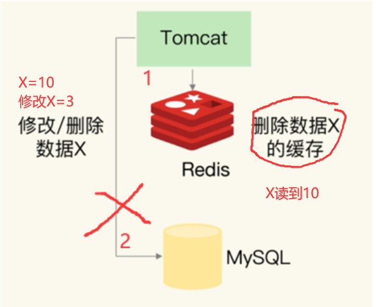
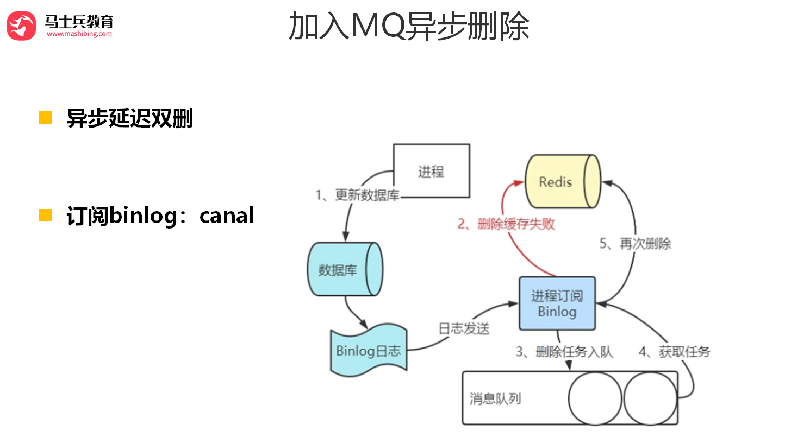

# 15、什么是缓存击穿？该如何解决

缓存击穿是指一个key非常热点，在不停的扛着大并发，大并发集中对一个点进行访问，当这个key在失效的瞬间，持续的大并发就会穿破缓存，直接请求数据库，就像在一个完好无损的桶上凿开了一个洞。

**就是存在的key过期了**

缓存击穿的话，设置热点数据永远不过期。或者加上互斥锁就能搞定了。

## **使用互斥锁**

业界比较常用的做法，是使用mutex。简单地来说，就是在缓存失效的时候（判断拿出来的值为空），不是立即去load db，而是先使用缓存工具的某些带成功操作返回值的操作（比如Redis的SETNX）去set一个mutex key，当操作返回成功时，再进行load db的操作并回设缓存；否则，就重试整个get缓存的方法。

伪代码如下图：



## **永远不过期**

这里的“永远不过期”包含两层意思：

(1) 从redis上看，确实没有设置过期时间，这就保证了，不会出现热点key过期问题，也就是“物理”不过期。

(2) 从功能上看，如果不过期，那不就成静态的了吗？所以我们把过期时间存在key对应的value里，如果发现要过期了，通过一个后台的异步线程进行缓存的构建，也就是“逻辑”过期

从实战看，这种方法对于性能非常友好，唯一不足的就是构建缓存时候，其余线程(非构建缓存的线程)可能访问的是老数据，但是对于一般的互联网功能来说这个还是可以忍受。

# 16、什么是缓存穿透？该如何解决

**缓存穿透**

是指查询一个根本不存在的数据，缓存层和存储层都不会命中，于是这个请求就可以随意访问数据库，这个就是缓存穿透，缓存穿透将导致不存在的数据每次请求都要到存储层去查询，失去了缓存保护后端存储的意义。

**就是不存在的key，导致缓存没用，还是直接去访问的DB**

**造成缓存穿透的基本原因有两个。**

第一，自身业务代码或者数据出现问题，比如，我们数据库的 id 都是1开始自增上去的，如发起为id值为 -1 的数据或 id 为特别大不存在的数据。如果不对参数做校验，数据库id都是大于0的，我一直用小于0的参数去请求你，每次都能绕开Redis直接打到数据库，数据库也查不到，每次都这样，并发高点就容易崩掉了。

第二,一些恶意攻击、爬虫等造成大量空命中。。



**如何解决??**

1.缓存空对象

当存储层不命中，到数据库查发现也没有命中，那么仍然将空对象保留到缓存层中，之后再访问这个数据将会从缓存中获取,这样就保护了后端数据源。**不过空值做了缓存，意味着缓存层中存了更多的键，需要更多的内存空间(如果是攻击，问题更严重),比较有效的方法是针对这类数据设置一个较短的过期时间，让其自动剔除。**

2.布隆过滤器拦截

在访问缓存层和存储层之前,将存在的key用布隆过滤器提前保存起来,做第一层拦截。例如:一个推荐系统有4亿个用户id，每个小时算法工程师会根据每个用户之前历史行为计算出推荐数据放到存储层中,但是最新的用户由于没有历史行为,就会发生缓存穿透的行为,为此可以将所有推荐数据的用户做成布隆过滤器。如果布隆过滤器认为该用户id不存在,那么就不会访问存储层,在一定程度保护了存储层。


这种方法适用于数据命中不高、数据相对固定、实时性低(通常是数据集较大)的应用场景,代码维护较为复杂,但是缓存空间占用少。

# 17、什么是缓存雪崩？该如何解决

缓存雪崩：由于缓存层承载着大量请求,有效地保护了存储层,但是如果缓存层由于某些原因不能提供服务，比如同一时间缓存数据大面积失效，那一瞬间Redis跟没有一样，于是所有的请求都会达到存储层，存储层的调用量会暴增，造成存储层也会级联宕机的情况。

缓存雪崩的英文原意是stampeding herd(奔逃的野牛)，指的是缓存层宕掉后，流量会像奔逃的野牛一样,打向后端存储。

预防和解决缓存雪崩问题,可以从以下三个方面进行着手。

**1）保证缓存层服务高可用性**。和飞机都有多个引擎一样，如果缓存层设计成高可用的,即使个别节点、个别机器、甚至是机房宕掉，依然可以提供服务，例如前面介绍过的Redis

Sentinel和 Redis Cluster都实现了高可用。

**2）依赖隔离组件为后端限流并降级**。无论是缓存层还是存储层都会有出错的概率，可以将它们视同为资源。作为并发量较大的系统，假如有一个资源不可用，可能会造成线程全部阻塞(hang)在这个资源上，造成整个系统不可用。

**3）提前演练**。在项目上线前，演练缓存层宕掉后，应用以及后端的负载情况以及可能出现的问题,在此基础上做一些预案设定。

**4）将缓存失效时间分散开**，比如我们可以在原有的失效时间基础上增加一个随机值，比如1-5分钟随机，这样每一个缓存的过期时间的重复率就会降低，就很难引发集体失效的事件。

# 18、什么是BigKey？该如何解决

## 什么是bigkey

bigkey是指key对应的value所占的内存空间比较大，例如一个字符串类型的value可以最大存到512MB，一个列表类型的value最多可以存储23-1个元素。

如果按照数据结构来细分的话，一般分为字符串类型bigkey和非字符串类型bigkey。

字符串类型：体现在单个value值很大，一般认为超过10KB就是bigkey，但这个值和具体的OPS相关。

非字符串类型：哈希、列表、集合、有序集合,体现在元素个数过多。

bigkey无论是空间复杂度和时间复杂度都不太友好，下面我们将介绍它的危害。

## bigkey的危害

bigkey的危害体现在三个方面:

**1、内存空间不均匀.(平衡)**：例如在Redis Cluster中，bigkey 会造成节点的内存空间使用不均匀。（redis的分片是按照key来分的）

**2、超时阻塞**：由于Redis单线程的特性，操作bigkey比较耗时，也就意味着阻塞Redis可能性增大。

**3、网络拥塞**：每次获取bigkey产生的网络流量较大

假设一个bigkey为1MB，每秒访问量为1000，那么每秒产生1000MB 的流量,对于普通的千兆网卡(按照字节算是128MB/s)的服务器来说简直是灭顶之灾，而且一般服务器会采用单机多实例的方式来部署,也就是说一个bigkey可能会对其他实例造成影响,其后果不堪设想。

bigkey的存在并不是完全致命的：

如果这个bigkey存在但是几乎不被访问,那么只有内存空间不均匀的问题存在,相对于另外两个问题没有那么重要紧急,但是如果bigkey是一个热点key(频繁访问)，那么其带来的危害不可想象,所以在实际开发和运维时一定要密切关注bigkey的存在。

## 发现bigkey

redis-cli --bigkeys可以命令统计bigkey的分布。


但是在生产环境中，开发和运维人员更希望自己可以定义bigkey的大小，而且更希望找到真正的bigkey都有哪些,这样才可以去定位、解决、优化问题。

判断一个key是否为bigkey，只需要执行debug object key查看serializedlength属性即可，它表示 key对应的value序列化之后的字节数。


如果是要遍历多个，则尽量不要使用keys的命令，可以使用scan的命令来减少压力。

### scan

Redis 从2.8版本后，提供了一个新的命令scan，它能有效的解决keys命令存在的问题。和keys命令执行时会遍历所有键不同,scan采用渐进式遍历的方式来解决 keys命令可能带来的阻塞问题，但是要真正实现keys的功能,需要执行多次scan。可以想象成只扫描一个字典中的一部分键，直到将字典中的所有键遍历完毕。scan的使用方法如下:

```
scan cursor [match pattern] [count number]
```

cursor ：是必需参数，实际上cursor是一个游标，第一次遍历从0开始，每次scan遍历完都会返回当前游标的值,直到游标值为0,表示遍历结束。

Match pattern ：是可选参数,它的作用的是做模式的匹配,这点和keys的模式匹配很像。

Count number ：是可选参数,它的作用是表明每次要遍历的键个数,默认值是10,此参数可以适当增大。



可以看到，第一次执行scan 0，返回结果分为两个部分:

第一个部分9就是下次scan需要的cursor

第二个部分是10个键。接下来继续

直到得到结果cursor变为0，说明所有的键已经被遍历过了。

除了scan 以外，Redis提供了面向哈希类型、集合类型、有序集合的扫描遍历命令，解决诸如hgetall、smembers、zrange可能产生的阻塞问题，对应的命令分别是hscan、sscan、zscan，它们的用法和scan基本类似，请自行参考Redis官网。


渐进式遍历可以有效的解决keys命令可能产生的阻塞问题，但是scan并非完美无瑕，如果在scan 的过程中如果有键的变化(增加、删除、修改)，那么遍历效果可能会碰到如下问题:新增的键可能没有遍历到，遍历出了重复的键等情况，也就是说scan并不能保证完整的遍历出来所有的键，这些是我们在开发时需要考虑的。

如果键值个数比较多，scan + debug object会比较慢，可以利用Pipeline机制完成。对于元素个数较多的数据结构，debug object执行速度比较慢，存在阻塞Redis的可能，所以如果有从节点,可以考虑在从节点上执行。

## 解决bigkey

主要思路为拆分，对 big key 存储的数据 （big value）进行拆分，变成value1，value2… valueN等等。

例如big value 是个大json 通过 mset 的方式，将这个 key 的内容打散到各个实例中，或者一个hash，每个field代表一个具体属性，通过hget、hmget获取部分value，hset、hmset来更新部分属性。

例如big value 是个大list，可以拆成将list拆成。= list_1， list_2, list3, ...listN

其他数据类型同理。

# 19、什么是热点Key？该如何解决

在Redis中，访问频率高的key称为热点key。

## 产生原因和危害

#### 原因

热点问题产生的原因大致有以下两种：

用户消费的数据远大于生产的数据（热卖商品、热点新闻、热点评论、明星直播）。

在日常工作生活中一些突发的事件，例如：双十一期间某些热门商品的降价促销，当这其中的某一件商品被数万次点击浏览或者购买时，会形成一个较大的需求量，这种情况下就会造成热点问题。同理，被大量刊发、浏览的热点新闻、热点评论、明星直播等，这些典型的读多写少的场景也会产生热点问题。

请求分片集中，超过单Server的性能极限。在服务端读数据进行访问时，往往会对数据进行分片切分，此过程中会在某一主机Server上对相应的Key进行访问，当访问超过Server极限时，就会导致热点Key问题的产生。

#### 危害

1、流量集中，达到物理网卡上限。

2、请求过多，缓存分片服务被打垮。

3、DB击穿，引起业务雪崩。

## 发现热点key

#### 预估发现

针对业务提前预估出访问频繁的热点key，例如秒杀商品业务中，秒杀的商品都是热点key。

当然并非所有的业务都容易预估出热点key，可能出现漏掉或者预估错误的情况。

#### 客户端发现

客户端其实是距离key"最近"的地方，因为Redis命令就是从客户端发出的，以Jedis为例，可以在核心命令入口，使用这个Google Guava中的AtomicLongMap进行记录，如下所示。

使用客户端进行热点key的统计非常容易实现，但是同时问题也非常多：

(1) 无法预知key的个数，存在内存泄露的危险。

(2) 对于客户端代码有侵入，各个语言的客户端都需要维护此逻辑，维护成本较高。

(3) 规模化汇总实现比较复杂。

## Redis发现

### monitor命令

monitor命令可以监控到Redis执行的所有命令，利用monitor的结果就可以统计出一段时间内的热点key排行榜，命令排行榜，客户端分布等数据。


Facebook开源的redis-faina正是利用上述原理使用Python语言实现的，例如下面获取最近10万条命令的热点key、热点命令、耗时分布等数据。为了减少网络开销以及加快输出缓冲区的消费速度，monitor尽可能在本机执行。

**此种方法会有两个问题：**

1、monitor命令在高并发条件下，内存暴增同时会影响Redis的性能，所以此种方法适合在短时间内使用。

2、只能统计一个Redis节点的热点key，对于Redis集群需要进行汇总统计。

**可以参考的框架：Facebook开源的redis-faina正是利用上述原理使用Python语言实现的**

### hotkeys

Redis在4.0.3中为redis-cli提供了--hotkeys，用于找到热点key。


如果有错误，需要先把内存逐出策略设置为allkeys-lfu或者volatile-lfu，否则会返回错误。




但是如果键值较多，执行较慢，和热点的概念的有点背道而驰，同时热度定义的不够准确。

### 抓取TCP包发现

Redis客户端使用TCP协议与服务端进行交互，通信协议采用的是RESP。如果站在机器的角度，可以通过对机器上所有Redis端口的TCP数据包进行抓取完成热点key的统计

此种方法对于Redis客户端和服务端来说毫无侵入，是比较完美的方案，但是依然存在3个问题：

(1) 需要一定的开发成本

(2) 对于高流量的机器抓包，对机器网络可能会有干扰，同时抓包时候会有丢包的可能性。

(3) 维护成本过高。

对于成本问题，有一些开源方案实现了该功能，**例如ELK(ElasticSearch Logstash Kibana)体系下的packetbeat[2] 插件**，可以实现对Redis、MySQL等众多主流服务的数据包抓取、分析、报表展示

## 解决热点key

发现热点key之后，需要对热点key进行处理。

#### 使用二级缓存

可以使用 guava-cache或hcache，发现热点key之后，将这些热点key加载到JVM中作为本地缓存。访问这些key时直接从本地缓存获取即可，不会直接访问到redis层了，有效的保护了缓存服务器。

#### key分散

将热点key分散为多个子key，然后存储到缓存集群的不同机器上，这些子key对应的value都和热点key是一样的。当通过热点key去查询数据时，通过某种hash算法随机选择一个子key，然后再去访问缓存机器，将热点分散到了多个子key上。

# 20、redis过期策略都有哪些？LRU 算法知道吗？

## 缓存淘汰算法（过期策略）

当 Redis 内存超出物理内存限制时，内存的数据会开始和磁盘产生频繁的交换 (swap)。交换会让 Redis 的性能急剧下降，对于访问量比较频繁的 Redis 来说，这样龟速的存取效率基本上等于不可用。

### Noeviction

noeviction 不会继续服务写请求
(DEL 请求可以继续服务)，读请求可以继续进行。这样可以保证不会丢失数据，但是会让线上的业务不能持续进行。这是默认的淘汰策略。

### volatile-lru

volatile-lru 尝试淘汰设置了过期时间的
key，最少使用的 key 优先被淘汰。没有设置过期时间的 key 不会被淘汰，这样可以保证需要持久化的数据不会突然丢失。

### volatile-ttl

volatile-ttl 跟上面一样，除了淘汰的策略不是 LRU，而是 key 的剩余寿命 ttl 的值，ttl 越小越优先被淘汰。

### volatile-random

volatile-random 跟上面一样，不过淘汰的 key 是过期 key 集合中随机的 key。

### allkeys-lru

allkeys-lru 区别于volatile-lru，这个策略要淘汰的 key 对象是全体的 key 集合，而不只是过期的 key 集合。这意味着没有设置过期时间的 key 也会被淘汰。

### allkeys-random

allkeys-random跟上面一样，不过淘汰的策略是随机的 key。

volatile-xxx 策略只会针对带过期时间的key 进行淘汰，allkeys-xxx 策略会对所有的 key 进行淘汰。如果你只是拿 Redis 做缓存，那应该使用 allkeys-xxx，客户端写缓存时不必携带过期时间。如果你还想同时使用 Redis 的持久化功能，那就使用 volatile-xxx 策略，这样可以保留没有设置过期时间的 key，它们是永久的 key 不会被 LRU 算法淘汰。

## LRU 算法

实现 LRU 算法除了需要key/value 字典外，还需要附加一个链表，链表中的元素按照一定的顺序进行排列。当空间满的时候，会踢掉链表尾部的元素。当字典的某个元素被访问时，它在链表中的位置会被移动到表头。所以链表的元素排列顺序就是元素最近被访问的时间顺序。

位于链表尾部的元素就是不被重用的元素，所以会被踢掉。位于表头的元素就是最近刚刚被人用过的元素，所以暂时不会被踢。


[Redis的LRU缓存淘汰算法实现 - 腾讯云开发者社区-腾讯云 (tencent.com)](https://cloud.tencent.com/developer/article/1925123)

## 近似 LRU 算法

Redis 使用的是一种近似 LRU 算法，它跟 LRU 算法还不太一样。之所以不使用 LRU 算法，是因为需要消耗大量的额外的内存，需要对现有的数据结构进行较大的改造。近似

LRU 算法则很简单，在现有数据结构的基础上使用随机采样法来淘汰元素，能达到和 LRU 算法非常近似的效果。Redis 为实现近似 LRU 算法，它给每个 key 增加了一个额外的小字段，这个字段的长度是 24 个 bit，也就是最后一次被访问的时间戳。

当 Redis 执行写操作时，发现内存超出maxmemory，就会执行一次 LRU 淘汰算法。这个算法也很简单，就是随机采样出 5(可以配置maxmemory-samples) 个 key，然后淘汰掉最旧的 key，如果淘汰后内存还是超出 maxmemory，那就继续随机采样淘汰，直到内存低于 maxmemory 为止。


如何采样就是看maxmemory-policy 的配置，如果是 allkeys 就是从所有的 key 字典中随机，如果是 volatile 就从带过期时间的 key 字典中随机。每次采样多少个 key 看的是 maxmemory_samples 的配置，默认为 5。

采样数量越大，近似 LRU 算法的效果越接近严格LRU 算法。

同时 Redis3.0 在算法中增加了淘汰池，新算法会维护一个候选池（大小为16），池中的数据根据访问时间进行排序，第一次随机选取的key都会放入池中，随后每次随机选取的key只有在访问时间小于池中最小的时间才会放入池中，直到候选池被放满。当放满后，如果有新的key需要放入，则将池中最后访问时间最大（最近被访问）的移除。进一步提升了近似 LRU 算法的效果。

## maxmemory

在生产环境中我们是不允许 Redis 出现交换行为的，为了限制最大使用内存，Redis 提供了配置参数 maxmemory 来限制内存超出期望大小。

当实际内存超出 maxmemory 时，Redis 提供了几种可选策略\(maxmemory-policy) 来让用户自己决定该如何腾出新的空间以继续提供读写服务。


# 20、讲一讲Redis缓存的数据一致性问题和处理方案

## 数据一致性

只要使用到缓存，无论是本地内存做缓存还是使用 redis 做缓存，那么就会存在数据同步的问题。

我以 Tomcat 向 MySQL 中写入和删改数据为例，来给你解释一下，数据的增删改操作具体是如何进行的。



我们分析一下几种解决方案，

1、先更新缓存，再更新数据库

2、先更新数据库，再更新缓存

3、先删除缓存，后更新数据库

4、先更新数据库，后删除缓存

### 新增数据类

如果是新增数据，数据会直接写到数据库中，不用对缓存做任何操作，此时，缓存中本身就没有新增数据，而数据库中是最新值，此时，缓存和数据库的数据是一致的。

### 更新缓存类

#### 1、先更新缓存，再更新DB

这个方案我们一般不考虑。原因是更新缓存成功，更新数据库出现异常了，导致缓存数据与数据库数据完全不一致，而且很难察觉，因为缓存中的数据一直都存在。



#### 2、先更新DB，再更新缓存

这个方案也我们一般不考虑，原因跟第一个一样，数据库更新成功了，缓存更新失败，同样会出现数据不一致问题。同时还有以下问题

*1* *）并发问题：*

*同时有请求A**和请求B**进行更新操作，那么会出现*

*（1* *）线程A*更新了数据库

*（2* *）线程B*更新了数据库

*（3* *）线程B*更新了缓存

*（4* *）线程A*更新了缓存

*这就出现请求A**更新缓存应该比请求B**更新缓存早才对，但是因为网络等原因，B**却比A**更早更新了缓存。这就导致了脏数据，因此不考虑。*

*2* *）业务场景问题*

*如果你是一个写数据库场景比较多，而读数据场景比较少的业务需求，采用这种方案就会导致，数据压根还没读到，缓存就被频繁的更新，浪费性能。*

**除了更新缓存之外，我们还有一种就是删除缓存。**

到底是选择更新缓存还是淘汰缓存呢？

主要取决于“更新缓存的复杂度”，更新缓存的代价很小，此时我们应该更倾向于更新缓存，以保证更高的缓存命中率，更新缓存的代价很大，此时我们应该更倾向于淘汰缓存。

### 删除缓存类

#### 3、先删除缓存，后更新DB

该方案也会出问题，具体出现的原因如下。

1、此时来了两个请求，请求 A（更新操作） 和请求 B（查询操作）

2、请求 A 会先删除 Redis 中的数据，然后去数据库进行更新操作；

3、此时请求 B 看到 Redis 中的数据时空的，会去数据库中查询该值，补录到 Redis 中；

4、但是此时请求 A 并没有更新成功，或者事务还未提交，请求B去数据库查询得到旧值；

5、那么这时候就会产生数据库和 Redis 数据不一致的问题。

如何解决呢？其实最简单的解决办法就是延时双删的策略。就是

（1）先淘汰缓存

（2）再写数据库

（3）休眠1秒，再次淘汰缓存

**这段伪代码就是“延迟双删”**

```java
redis.delKey(X)
db.update(X)
Thread.sleep(N)
redis.delKey(X)
```

这么做，可以将1秒内所造成的缓存脏数据，再次删除。

那么，这个1秒怎么确定的，具体该休眠多久呢？

针对上面的情形，读该自行评估自己的项目的读数据业务逻辑的耗时。然后写数据的休眠时间则在读数据业务逻辑的耗时基础上，加几百ms即可。这么做的目的，就是确保读请求结束，写请求可以删除读请求造成的缓存脏数据。

但是上述的保证事务提交完以后再进行删除缓存还有一个问题，就是如果你使用的是** Mysql ****的读写分离的架构**的话，那么其实主从同步之间也会有时间差。

此时来了两个请求，请求 A（更新操作） 和请求 B（查询操作）

请求 A 更新操作，删除了
Redis，

请求主库进行更新操作，主库与从库进行同步数据的操作，

请 B 查询操作，发现 Redis
中没有数据，

去从库中拿去数据，此时同步数据还未完成，拿到的数据是旧数据。

此时的解决办法有两个：

1、还是使用双删延时策略。只是，睡眠时间修改为在主从同步的延时时间基础上，加几百ms。

2、就是如果是对 Redis
进行填充数据的查询数据库操作，那么就强制将其指向主库进行查询。

继续深入，**采用这种同步淘汰策略，吞吐量降低怎么办？**

那就将第二次删除作为异步的。自己起一个线程，异步删除。这样，写的请求就不用沉睡一段时间后了，再返回。这么做，加大吞吐量。

继续深入，**第二次删除,如果删除失败怎么办？**

所以，我们引出了，下面的第四种策略，先更新数据库，再删缓存。

#### 4、先更新DB，后删除缓存

这种方式，被称为Cache Aside Pattern，读的时候，先读缓存，缓存没有的话，就读数据库，然后取出数据后放入缓存，同时返回响应。更新的时候，先更新数据库，然后再删除缓存。

### 如何选择问题

一般在线上，更多的偏向与使用删除缓存类操作，因为这种方式的话，会更容易避免一些问题。

因为删除缓存更新缓存的速度比在DB中要快一些，所以一般情况下我们可能会先用先更新DB，后删除缓存的操作。因为这种情况下缓存不一致性的情况只有可能是查询比删除慢的情况，而这种情况相对来说会少很多。同时结合延时双删的处理，可以有效的避免缓存不一致的情况。


